# 阶段感知专家系统 — 深度架构解析

## 一、系统定位与核心理念

阶段感知专家系统是 DecoPilot 的**核心智能层**，其设计理念是：

> **不同阶段的用户，面对的问题完全不同，需要的不是一个"万能客服"，而是一个能随阶段切换身份的"专家团队"。**

系统实现了**动态专家角色切换**——当用户处于装修准备期，AI 扮演"装修规划师"；进入施工期，AI 自动变身"工程监理"；到了软装阶段，AI 又成为"软装搭配师"。整个过程对用户透明、无感知。

---

## 二、系统架构全景

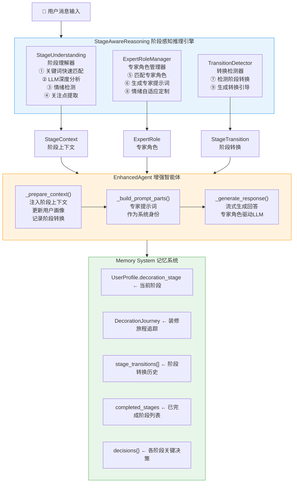

---

## 三、阶段定义体系

### 3.1 C端（业主）— 5个装修阶段

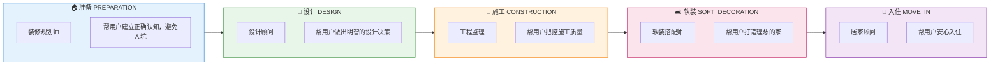

### 3.2 B端（商家）— 4个经营阶段

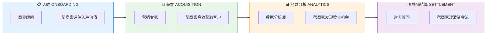

### 3.3 阶段流转总览

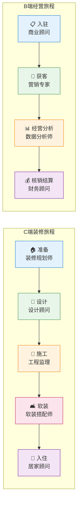

---

## 四、阶段检测机制（双层检测）

系统采用**关键词快速匹配 + LLM 深度分析**的双层检测策略：

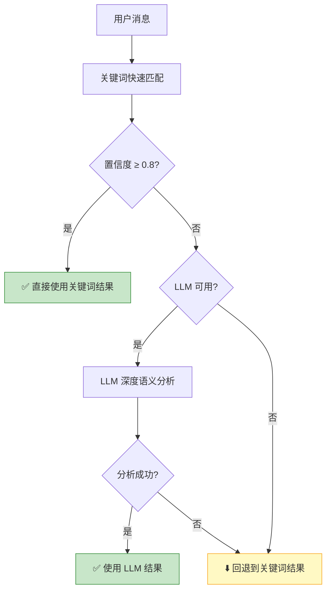

### 4.1 关键词匹配引擎

每个阶段配置三类关键词，权重不同：

| 关键词类型 | 权重 | 说明 |
|:---:|:---:|:---|
| **显式关键词** | +3.0 | 直接表明阶段的词 |
| **隐式关键词** | +2.0 | 间接暗示阶段的词 |
| **问题关键词** | +1.5 | 该阶段典型问题 |

**置信度计算公式：** `confidence = min(1.0, best_score / 6.0)`

- 匹配到 2 个显式关键词（6.0分）→ 置信度 **100%**
- 匹配到 1 个显式 + 1 个隐式（5.0分）→ 置信度 **83%**
- 无任何匹配 → 默认置信度 **30%**，回退到默认阶段

### 4.2 C端完整关键词库

**准备阶段：**
- 🔴 显式：准备装修、打算装修、想装修、刚买房、毛坯
- 🟡 隐式：预算多少、怎么开始、全包半包、装修公司怎么选
- 🔵 问题：装修要准备什么、第一步做什么、需要多少钱

**设计阶段：**
- 🔴 显式：设计方案、设计师、效果图、量房、出图
- 🟡 隐式：风格选择、户型改造、动线、收纳设计、报价单
- 🔵 问题：方案怎么样、报价合理吗、要不要改

**施工阶段：**
- 🔴 显式：施工中、在装修、正在装、开工了、工人
- 🟡 隐式：水电、贴砖、刷漆、吊顶、防水、找平
- 🔵 问题：质量有问题、空鼓、开裂、漏水、验收标准

**软装阶段：**
- 🔴 显式：软装、买家具、选家具、硬装完、家具进场
- 🟡 隐式：沙发、床、餐桌、窗帘、灯具、地毯
- 🔵 问题：选什么颜色、尺寸多大、怎么搭配

**入住阶段：**
- 🔴 显式：入住、搬家、装完了、已经装好、住进去
- 🟡 隐式：通风、甲醛、除味、保洁、开荒
- 🔵 问题：多久能住、甲醛超标吗、怎么除甲醛

### 4.3 B端完整关键词库

**入驻阶段：**
- 🔴 显式：入驻、开店、加入平台、想入驻、怎么入驻
- 🟡 隐式：入驻条件、保证金、资质要求、入驻流程、开店费用
- 🔵 问题：能入驻吗、需要什么条件、费用多少、多久能开通

**获客阶段：**
- 🔴 显式：获客、找客户、拓客、引流、客源
- 🟡 隐式：转化率、客户跟进、话术、触达、线索、咨询量
- 🔵 问题：怎么获客、转化率低、客户不回复、怎么跟进

**经营分析阶段：**
- 🔴 显式：数据分析、经营分析、看数据、报表
- 🟡 隐式：ROI、投入产出、转化漏斗、客单价、复购率、流量
- 🔵 问题：ROI多少、数据怎么看、哪里有问题、怎么提升

**核销结算阶段：**
- 🔴 显式：核销、结算、提现、到账、佣金
- 🟡 隐式：结算周期、服务费、扣款、退款、账单
- 🔵 问题：什么时候到账、怎么结算、扣了多少、钱去哪了

### 4.4 LLM 深度分析

当关键词置信度 < 0.8 时，系统调用 LLM（Qwen-plus）进行深度语义分析。LLM 接收以下输入：

- **用户画像**：当前阶段、预算、偏好风格、房屋面积
- **对话历史**：最近5轮对话
- **当前问题**：用户本次输入
- **可选阶段**：阶段列表及描述

LLM 返回结构化 JSON，包含：

```json
{
    "stage": "施工",
    "confidence": 0.85,
    "surface_question": "用户在问瓷砖空鼓怎么处理",
    "deep_need": "确保施工质量，及时发现问题",
    "potential_needs": ["验收标准", "与工人沟通方法"],
    "emotional_state": "焦虑",
    "focus_points": ["质量"],
    "stage_changed": false,
    "transition_trigger": null
}
```

---

## 五、核心数据结构

### 5.1 StageContext（阶段上下文）

这是阶段检测的核心输出，贯穿整个处理流程：

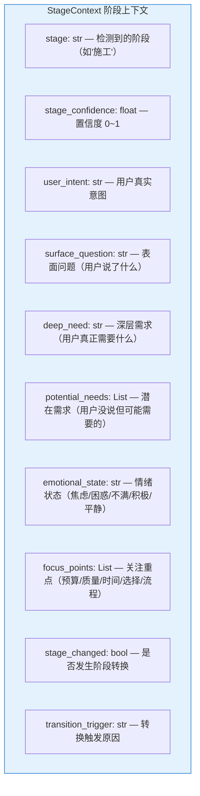

### 5.2 ExpertRole（专家角色）

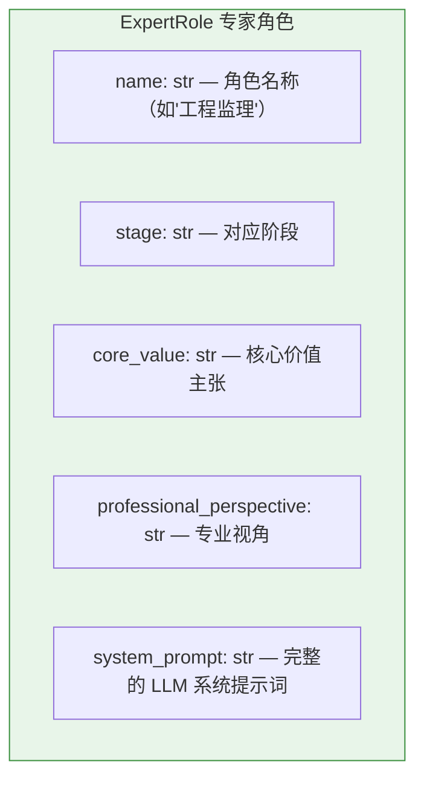

### 5.3 StageTransition（阶段转换）

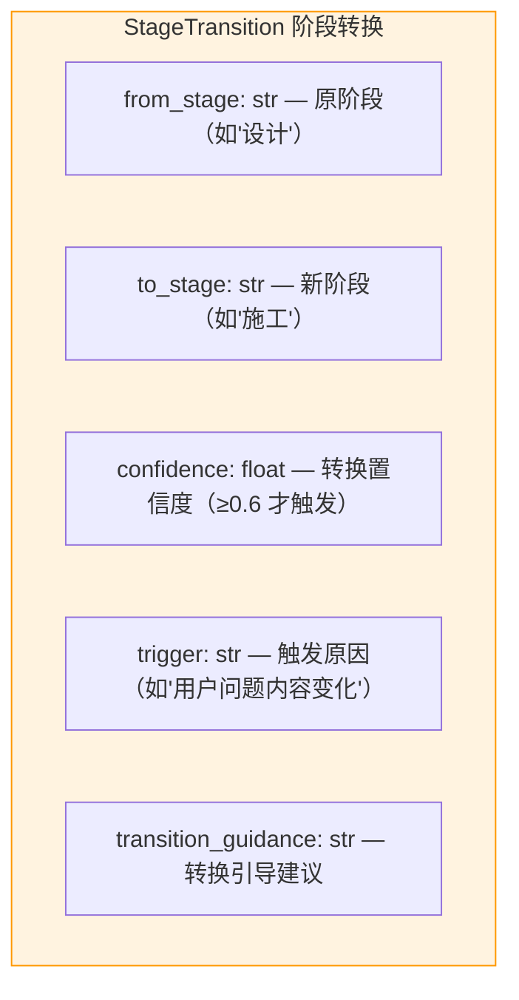

### 5.4 DecorationJourney（装修旅程 — 记忆系统中的持久化结构）

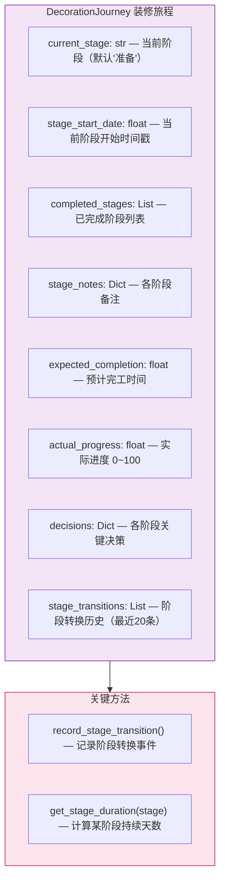

---

## 六、9大专家角色 Prompt 详解

系统为 C端5个阶段 + B端4个阶段，共定义了 **9个专家角色**，每个角色拥有完整的人设、思维方式和行为准则。

### 6.1 C端专家角色

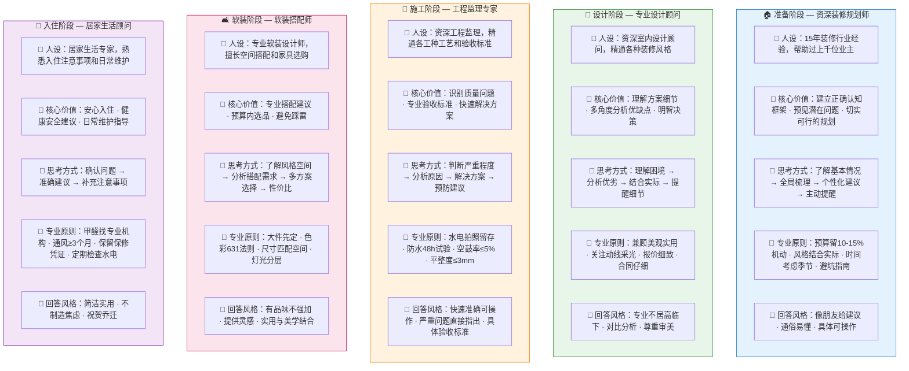

### 6.2 B端专家角色

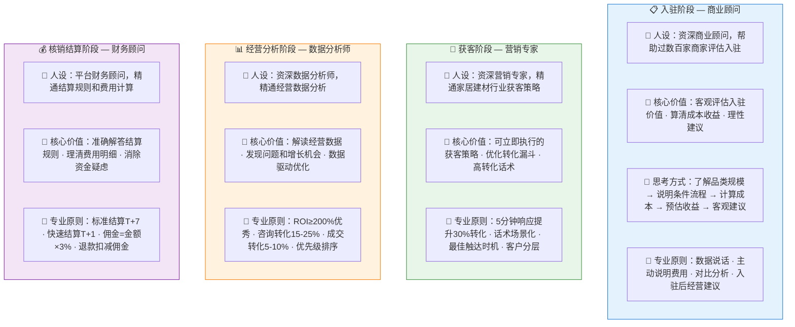

---

## 七、情绪感知与自适应机制

系统不仅检测阶段，还感知用户情绪并动态调整回复策略。

### 7.1 情绪检测引擎

通过关键词匹配检测5种情绪状态：

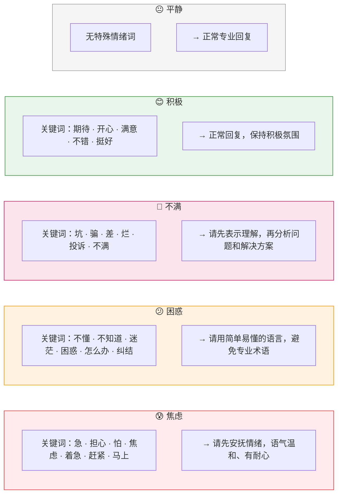

### 7.2 关注点提取

系统自动识别用户当前关注的维度：

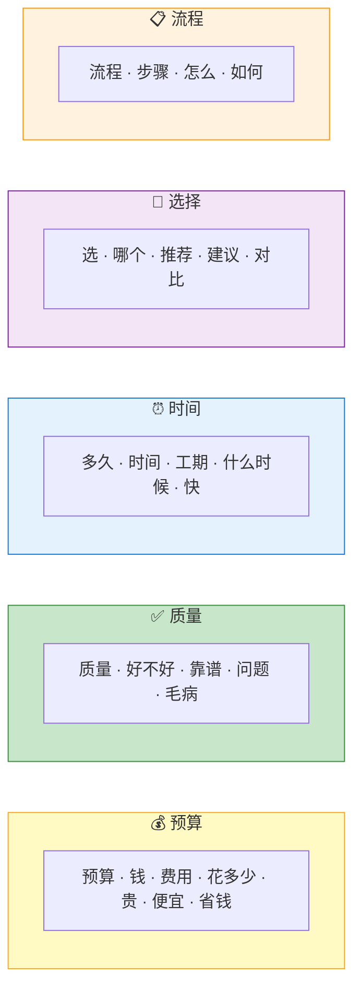

### 7.3 Prompt 动态定制流程

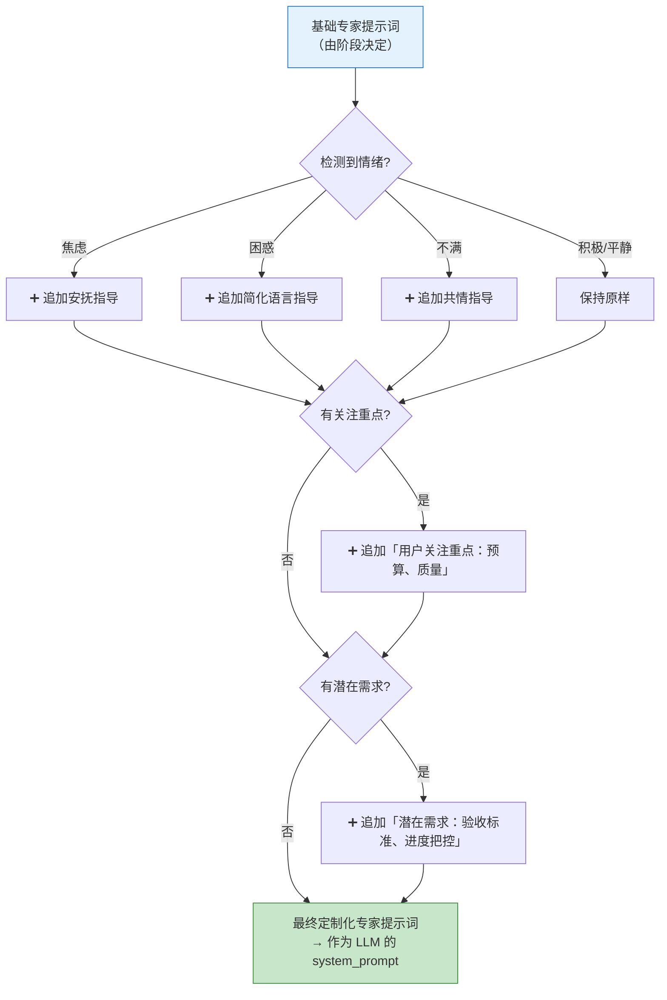

代码实现位于 `stage_reasoning.py` 的 `get_expert_system_prompt()` 方法：

```python
def get_expert_system_prompt(self, stage, user_type, context=None):
    base_prompt = self.expert_manager.get_expert_prompt(stage, user_type)
    if context:
        if context.emotional_state == "焦虑":
            base_prompt += "\n## 特别注意\n用户当前比较焦虑，请先安抚情绪..."
        elif context.emotional_state == "困惑":
            base_prompt += "\n## 特别注意\n用户当前比较困惑，请用简单易懂的语言..."
        elif context.emotional_state == "不满":
            base_prompt += "\n## 特别注意\n用户当前有不满情绪，请先表示理解..."
        if context.focus_points:
            base_prompt += f"\n## 用户关注重点\n{', '.join(context.focus_points)}"
        if context.potential_needs:
            base_prompt += f"\n## 可能的潜在需求\n{', '.join(context.potential_needs)}"
    return base_prompt
```

---

## 八、阶段转换机制

### 8.1 转换检测逻辑

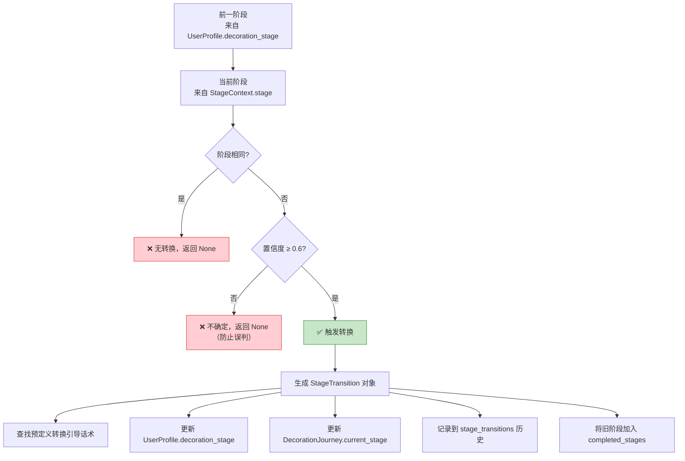

### 8.2 预定义转换引导话术

**C端阶段转换引导：**

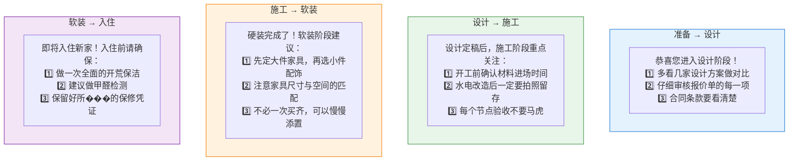

**B端阶段转换引导：**

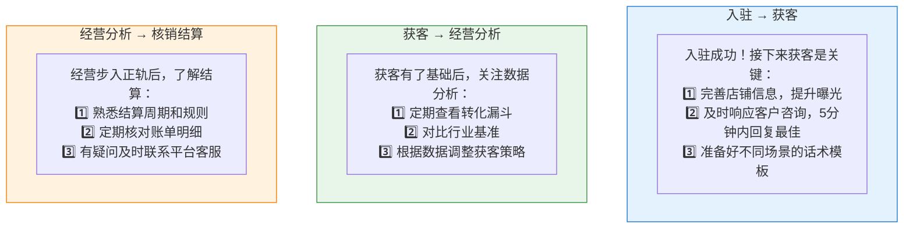

> 💡 非预定义路径（如跳跃式转换）的兜底话术：`"您已进入{to_stage}阶段，有什么可以帮您的？"`

---

## 九、与 EnhancedAgent 的集成流程

阶段感知专家系统深度嵌入 `EnhancedAgent` 的核心处理流程。以下是完整的 **12步处理流水线**，★ 标记为阶段感知系统参与的环节：

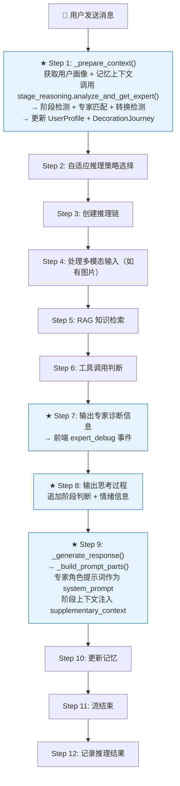

**Step 9 中 system_prompt 的确定逻辑：**

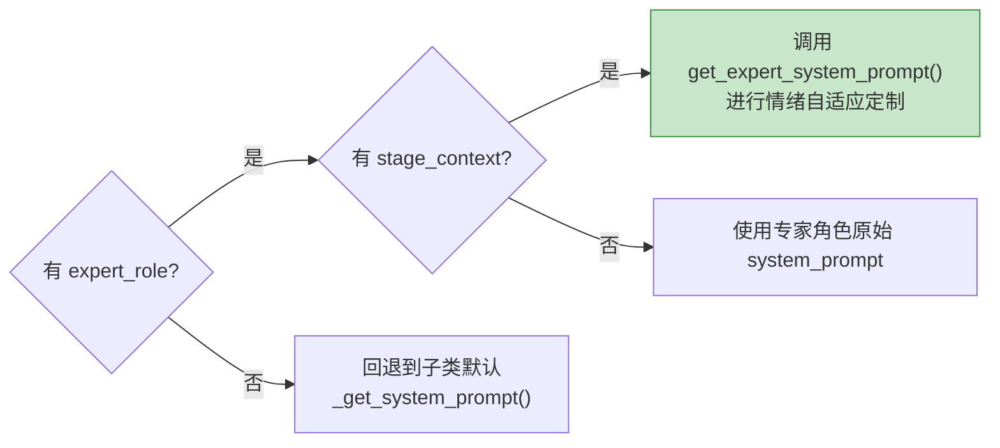

**supplementary_context 的构建内容：**

1. ★ 阶段转换引导（如有）
2. 用户画像（兴趣/风格/预算）
3. ★ 阶段感知上下文（阶段/置信度/深层需求/潜在需求/情绪/关注点）
4. 用户痛点
5. 推断的需求
6. 知识检索结果
7. 工具调用结果
8. 图片分析结果

---

## 十、前端展示层

前端通过 `ExpertDebugBlock` 组件展示阶段感知诊断信息，位于每条 AI 回复的顶部。

### 10.1 数据流

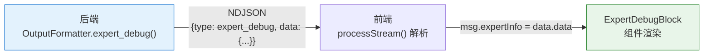

### 10.2 UI 展示结构

**折叠态（默认）：** 一行灰色小字

> 🎯 工程监理 · 施工阶段 · 85% ▸

**展开态（点击后）：**

> 🎯 工程监理 · 施工阶段 · 85% ▾
> - 专家价值：帮用户把控施工质量
> - 用户情绪：焦虑
> - 关注重点：质量
> - 深层需求：确保施工质量，及时发现问题
> - 潜在需求：验收标准、进度把控、质量问题处理
> - ⚡ 设计 → 施工（85%）← 仅在发生阶段转换时显示

### 10.3 关键实现细节

- 组件使用 `React.memo` 优化渲染性能
- 展开/折叠状态通过 `expandedExpert` state 管理，按消息 ID 独立控制
- 置信度显示为百分比：`Math.round(stage_confidence * 100)`
- 阶段转换用橙色高亮显示，带闪电图标 ⚡

---

## 十一、与记忆系统的协同

阶段感知系统与三层记忆系统深度协同，形成**"感知-记忆-演进"**闭环：

```mermaid
graph TD
    SR["🧠 阶段感知专家系统<br/>Stage Reasoning"] --> STM
    SR --> LTM
    SR --> WM

    subgraph 三层记忆系统
        STM["短期记忆<br/>（对话历史）"]
        LTM["长期记忆<br/>（用户画像）"]
        WM["工作记忆<br/>（任务数据）"]
    end

    LTM --> UP

    subgraph UP["UserProfile 用户画像"]
        DS["decoration_stage ← 阶段感知写入"]
        DJ["decoration_journey ← 旅程追踪"]
        STS["stage_transitions[] ← 转换历史"]
        CSS["completed_stages ← 已完成阶段"]
        DECC["decisions{} ← 阶段决策"]
        PP["pain_points[] ← 痛点检测写入"]
        INT["interests{} ← 兴趣衰减更新"]
    end

    STM -->|"对话历史（最近5轮）<br/>供 LLM 深度分析"| SR

    style SR fill:#E3F2FD,stroke:#1976D2
    style UP fill:#FFF3E0,stroke:#FF9800
```

**协同机制：**

1. **读取**：阶段感知系统从 `UserProfile.decoration_stage` 读取上一次的阶段，作为转换检测的基准
2. **分析**：从短期记忆中获取对话历史，供 LLM 深度分析上下文
3. **写入**：检测到阶段转换后，更新 `UserProfile.decoration_stage` 和 `DecorationJourney`
4. **追踪**：`DecorationJourney` 持久化记录完整的阶段转换历史，支持计算各阶段持续天数
5. **推断**：`UserProfile.infer_next_need()` 根据当前阶段和痛点，推断用户下一个可能的需求

---

## 十二、阶段相关的辅助信息系统

除了专家角色切换，系统还为每个阶段提供配套的辅助信息。

### 12.1 阶段提示（Stage Tips）

```mermaid
graph TD
    subgraph ST1["🏠 准备"]
        ST1A["✅ 确定装修预算，建议留10%机动资金"]
        ST1B["✅ 多看装修案例，明确喜欢的风格"]
        ST1C["✅ 了解装修流程，做好时间规划"]
    end
    subgraph ST2["🎨 设计"]
        ST2A["✅ 仔细审核设计方案，确认每个细节"]
        ST2B["✅ 注意动线设计是否合理"]
        ST2C["✅ 确认收纳空间是否充足"]
    end
    subgraph ST3["🔨 施工"]
        ST3A["✅ 定期到现场检查施工质量"]
        ST3B["✅ 水电改造后拍照留存管线走向"]
        ST3C["✅ 防水必须做闭水试验"]
    end
    subgraph ST4["🛋️ 软装"]
        ST4A["✅ 家具尺寸要提前确认"]
        ST4B["✅ 注意家具与整体风格的搭配"]
        ST4C["✅ 软装可以分批购买，不必一次到位"]
    end
    subgraph ST5["🏡 入住"]
        ST5A["✅ 入住前做甲醛检测"]
        ST5B["✅ 建议通风3个月以上"]
        ST5C["✅ 保留好各项保修凭证"]
    end

    style ST1 fill:#E3F2FD,stroke:#1976D2
    style ST2 fill:#E8F5E9,stroke:#388E3C
    style ST3 fill:#FFF3E0,stroke:#F57C00
    style ST4 fill:#FCE4EC,stroke:#C2185B
    style ST5 fill:#F3E5F5,stroke:#7B1FA2
```

### 12.2 阶段推荐话题（Stage Topics）

```mermaid
graph LR
    subgraph TP1["🏠 准备"]
        TP1A["预算规划 · 风格选择<br/>装修公司选择 · 设计师选择"]
    end
    subgraph TP2["🎨 设计"]
        TP2A["方案优化 · 材料选择<br/>报价审核 · 合同注意事项"]
    end
    subgraph TP3["🔨 施工"]
        TP3A["施工进度 · 质量验收<br/>材料进场 · 工艺标准"]
    end
    subgraph TP4["🛋️ 软装"]
        TP4A["家具选购 · 软装搭配<br/>灯具选择 · 窗帘布艺"]
    end
    subgraph TP5["🏡 入住"]
        TP5A["甲醛治理 · 家电选购<br/>收纳整理 · 维护保养"]
    end

    TP1 --> TP2 --> TP3 --> TP4 --> TP5

    style TP1 fill:#E3F2FD,stroke:#1976D2
    style TP2 fill:#E8F5E9,stroke:#388E3C
    style TP3 fill:#FFF3E0,stroke:#F57C00
    style TP4 fill:#FCE4EC,stroke:#C2185B
    style TP5 fill:#F3E5F5,stroke:#7B1FA2
```

### 12.3 深层需求推断（Deep Need Inference）

系统根据阶段自动推断用户的深层需求，即使用户没有明确表达：

```mermaid
graph TD
    subgraph DN["深层需求推断"]
        subgraph DN1["准备/入驻"]
            DN1C["C端：建立正确的装修认知，避免踩坑"]
            DN1B["B端：评估入驻价值，做出理性决策"]
        end
        subgraph DN2["设计/获客"]
            DN2C["C端：做出明智的设计决策"]
            DN2B["B端：高效获取客户，提升转化"]
        end
        subgraph DN3["施工/经营分析"]
            DN3C["C端：确保施工质量，及时发现问题"]
            DN3B["B端：发现问题和机会，优化经营"]
        end
        subgraph DN4["软装/核销结算"]
            DN4C["C端：打造理想的家居环境"]
            DN4B["B端：理��资金流，消除疑虑"]
        end
        subgraph DN5["入住"]
            DN5C["C端：安心入住，了解维护保养"]
        end
    end

    style DN1 fill:#E3F2FD,stroke:#1976D2
    style DN2 fill:#E8F5E9,stroke:#388E3C
    style DN3 fill:#FFF3E0,stroke:#F57C00
    style DN4 fill:#FCE4EC,stroke:#C2185B
    style DN5 fill:#F3E5F5,stroke:#7B1FA2
```

### 12.4 潜在需求推断（Potential Needs Inference）

系统主动预判用户"没说但可能需要"的信息：

```mermaid
graph TD
    subgraph PN["潜在需求推断"]
        subgraph PN1["准备/入驻"]
            PN1C["C端：预算规划建议 · 装修公司选择 · 时间规划"]
            PN1B["B端：费用明细 · 入驻流程 · 经营建议"]
        end
        subgraph PN2["设计/获客"]
            PN2C["C端：报价审核 · 合同注意事项 · 材料选择"]
            PN2B["B端：话术模板 · 触达时机 · 客户分层"]
        end
        subgraph PN3["施工/经营分析"]
            PN3C["C端：验收标准 · 进度把控 · 质量问题处理"]
            PN3B["B端：行业对比 · 优化建议 · 增长机会"]
        end
        subgraph PN4["软装/核销结算"]
            PN4C["C端：搭配建议 · 品牌推荐 · 尺寸选择"]
            PN4B["B端：结算规则 · 费用明细 · 提现方式"]
        end
        subgraph PN5["入住"]
            PN5C["C端：甲醛检测 · 保养知识 · 保修事项"]
        end
    end

    style PN1 fill:#E3F2FD,stroke:#1976D2
    style PN2 fill:#E8F5E9,stroke:#388E3C
    style PN3 fill:#FFF3E0,stroke:#F57C00
    style PN4 fill:#FCE4EC,stroke:#C2185B
    style PN5 fill:#F3E5F5,stroke:#7B1FA2
```

---

## 十三、痛点检测与联动

阶段感知系统与痛点检测系统联动，在 `_update_user_context()` 中自动识别并记录用户痛点。

### 13.1 痛点检测规则

```mermaid
graph TD
    subgraph PP["痛点检测规则"]
        subgraph PP1["💰 预算 — 严重度 0.8"]
            PP1K["超预算 · 预算不够 · 太贵 · 花太多 · 控制预算 · 省钱"]
        end
        subgraph PP2["⚠️ 质量 — 严重度 0.9（最高）"]
            PP2K["质量差 · 有问题 · 不满意 · 返工 · 空鼓 · 开裂 · 漏水"]
        end
        subgraph PP3["⏰ 工期 — 严重度 0.6"]
            PP3K["太慢 · 延期 · 拖延 · 什么时候完 · 等太久"]
        end
        subgraph PP4["🔄 选择困难 — 严重度 0.5"]
            PP4K["不知道选 · 选哪个 · 纠结 · 怎么选 · 哪个好"]
        end
        subgraph PP5["💬 沟通 — 严重度 0.7"]
            PP5K["沟通不畅 · 不理人 · 联系不上 · 态度差"]
        end
    end

    style PP2 fill:#FFCDD2,stroke:#E53935
    style PP1 fill:#FFE0B2,stroke:#FF9800
    style PP5 fill:#FFF3E0,stroke:#FF9800
    style PP3 fill:#FFF9C4,stroke:#F9A825
    style PP4 fill:#F5F5F5,stroke:#9E9E9E
```

### 13.2 痛点与需求推断的联动

```python
# UserProfile.infer_next_need() 中的联动逻辑
if self.pain_points:
    recent_pain = self.pain_points[-1]
    if recent_pain["severity"] > 0.7:  # 高严重度痛点优先
        return {
            "type": "pain_point_resolution",
            "suggestion": f"解决{recent_pain['type']}问题",
            "reason": recent_pain["description"]
        }
```

当用户存在高严重度痛点（>0.7）时，系统会**优先推断用户需要解决该痛点**，而非按阶段默认推荐。例如：

- 用户处于施工阶段，正常推断需求是"施工进度和质量监督"
- 但如果用户刚说了"漏水"（质量痛点，严重度0.9），系统会优先推断需求为"解决质量问题"

---

## 十四、全局单例与 LLM 延迟绑定

阶段感知推理引擎采用**全局单例 + LLM 延迟绑定**模式：

```python
_stage_reasoning: Optional[StageAwareReasoning] = None

def get_stage_reasoning(llm=None) -> StageAwareReasoning:
    global _stage_reasoning

    if _stage_reasoning is None:
        # 首次创建：如果传入 LLM，则启用深度分析
        llm_caller = _wrap_llm(llm) if llm else None
        _stage_reasoning = StageAwareReasoning(llm_caller=llm_caller)

    elif llm is not None and _stage_reasoning.stage_understanding.llm_caller is None:
        # 实例已存在但尚未设置 LLM：补充绑定
        _stage_reasoning.set_llm_caller(_wrap_llm(llm))

    return _stage_reasoning
```

**设计意图：**

```mermaid
graph TD
    subgraph S["全局单例行为"]
        subgraph S1["首次调用，传入 LLM"]
            S1A["创建实例，启用关键词 + LLM 双层检测"]
        end
        subgraph S2["首次调用，未传入 LLM"]
            S2A["创建实例，仅使用关键词检测"]
        end
        subgraph S3["后续调用，实例已存在"]
            S3A["直接返回单例"]
        end
        subgraph S4["后续调用，实例存在但无 LLM，现在传入"]
            S4A["补充绑定 LLM，升级为双层检测"]
        end
    end

    style S1 fill:#C8E6C9,stroke:#388E3C
    style S2 fill:#FFF9C4,stroke:#F9A825
    style S3 fill:#E3F2FD,stroke:#1976D2
    style S4 fill:#E8F5E9,stroke:#388E3C
```

在 `EnhancedAgent.__init__()` 中的实际调用：

```python
self.llm = ChatTongyi(model="qwen-plus", temperature=0.7, streaming=True)
self.stage_reasoning = get_stage_reasoning(llm=self.llm)  # 传入LLM启用深度分析
```

---

## 十五、完整场景演示

以下用 **4个完整对话场景**，覆盖 C端准备→设计→施工阶段转换、情绪自适应、B端获客场景，全面展示阶段感知专家系统的运作。

---

### 场景一：C端准备阶段 — 装修规划师

**用户输入：**

> 我刚买了一套89平的房子，准备装修，预算大概15万，不知道从哪开始

**系统内部处理：**

- **关键词匹配**："准备装修" → 准备阶段（显式 +3.0），"预算" → 准备阶段（隐式 +2.0）→ 总分 5.0 → 置信度 **83%**
- **情绪检测**："不知道" → 😕 困惑
- **关注点**："从哪开始" → 📋 流程 ；"预算" → 💰 预算
- **专家角色**：🏠 装修规划师
- **深层需求**：建立正确的装修认知，避免踩坑
- **潜在需求**：预算规划建议、装修公司选择、时间规划
- **system_prompt 定制**：装修规划师提示词 + 「用户当前比较困惑，请用简单易懂的语言解释」+ 「用户关注重点：流程、预算」

**前端显示：**

> 🎯 装修规划师 · 准备阶段 · 83%

**AI 回复（以装修规划师身份）：**

> 恭喜您拿到新房！89平、15万预算，完全可以装出一个舒适温馨的家。我帮您梳理一下整体规划：
>
> ### 📋 装修流程总览
>
> 89平的房子，正常装修周期大约 **3-4个月**，建议按以下顺序推进：
>
> 1. **前期准备（2-3周）**：确定风格、找装修公司/设计师、量房出方案
> 2. **设计阶段（2-4周）**：确认设计方案、审核报价、签合同
> 3. **硬装施工（2-3个月）**：拆改 → 水电 → 瓦工 → 木工 → 油漆
> 4. **软装入住（2-4周）**：家具家电进场、通风除醛
>
> ### 💰 15万预算分配建议
>
> | 项目 | 占比 | 金额 | 说明 |
> |------|------|------|------|
> | 硬装（含人工+辅材） | 45% | 6.75万 | 水电、瓦工、木工、油漆 |
> | 主材 | 25% | 3.75万 | 瓷砖、地板、门、橱柜、卫浴 |
> | 家具家电 | 20% | 3万 | 沙发、床、餐桌、冰箱、洗衣机等 |
> | 软装配饰 | 5% | 0.75万 | 窗帘、灯具、装饰画等 |
> | ⚠️ 机动资金 | 5% | 0.75万 | **一定要留！** 装修几乎100%会超预算 |
>
> ### 🎯 当前第一步建议
>
> 1. **明确风格偏好**：先刷刷小红书、好好住，收藏喜欢的案例图，不用太精确，大方向就行（现代简约最省钱，也最耐看）
> 2. **找2-3家装修公司对比**：建议同时看全包和半包的报价，89平半包大概4-6万，全包8-12万
> 3. **量房**：正规公司都免费量房出初步方案，多看几家不吃亏
>
> ### ⚠️ 新手避坑提醒
>
> - **不要先买家具**：等设计方案定了再买，否则尺寸可能不合适
> - **不要一次付清**：装修款按进度分期付（建议 30%-30%-30%-10%）
> - **不要只看总价**：要看报价单的每一项明细，特别是"增项"陷阱
>
> 您目前有倾向的装修风格吗？或者有特别在意的空间（比如厨房、卫生间）？我可以针对性地给您更详细的建议 😊

---

### 场景二：设计→施工阶段转换 — 工程监理自动接管

**用户输入：**

> 方案定了，现在开工了，水电改造工人说要走顶，靠谱吗？

**系统内部处理：**

- **关键词匹配**："开工了" → 施工阶段（显式 +3.0），"水电" → 施工阶段（隐式 +2.0），"工人" → 施工阶段（显式 +3.0）→ 总分 8.0 → 置信度 **100%**
- **情绪检测**："靠谱吗" → 😐 平静
- **关注点**："靠谱" → ✅ 质量
- **⚡ 阶段转换检测**：
    - 前一阶段："设计"（来自 UserProfile）
    - 当前阶段："施工"（置信度 100% ≥ 0.6）
    - ✅ 触发转换！
    - 转换引导："设计定稿后，施工阶段需要重点关注：1）开工前确认材料进场时间..."
    - 更新 `UserProfile.decoration_stage = "施工"`
    - 更新 `DecorationJourney.current_stage = "施工"`
    - "设计" 加入 `completed_stages`
    - 记录 `stage_transitions: [{from: "设计", to: "施工", confidence: 1.0}]`
- **专家角色**：🔨 工程监理 ← 从"装修规划师"自动切换
- **深层需求**：确保施工质量，及时发现问题
- **潜在需求**：验收标准、进度把控、质量问题处理

**前端显示：**

> 🎯 工程监理 · 施工阶段 · 100%
> ⚡ 设计 → 施工（100%）

**AI 回复（以工程监理身份）：**

> 恭喜开工！水电走顶是目前**主流且推荐**的做法，您的工人建议是专业的，可以放心。我从监理角度帮您详细分析：
>
> ### 🔍 走顶 vs 走地 对比分析
>
> | 对比项 | 走顶（推荐✅） | 走地 |
> |--------|---------------|------|
> | **检修难度** | 拆吊顶即可检修，方便快捷 | 需要砸地面，破坏大 |
> | **漏水风险** | 漏水能及时发现（天花板渗水） | 漏水不易察觉，可能泡坏地板 |
> | **对楼下影响** | 漏水不影响楼下 | 可能渗漏到楼下引发纠纷 |
> | **材料用量** | 多用约15-20%管材 | 管材用量少 |
> | **费用差异** | 多花约 **2000-3000元** | 相对便宜 |
> | **施工难度** | 需要专业管卡固定 | 施工相对简单 |
>
> **结论**：多花2-3千换来的是长期安心，非常值得。
>
> ### ⚠️ 水电走顶验收要点（重要！请收藏）
>
> **施工中必须检查：**
> 1. **管卡固定**：每隔 **60cm** 必须有一个管卡，管道不能有明显下垂
> 2. **热水管保温**：热水管必须包 **保温棉**，否则冬天热水到达慢、能耗高
> 3. **冷热管间距**：冷热水管间距 ≥ **15cm**，防止互相影响水温
> 4. **管道走向**：横平竖直，转弯处用弯头不能折弯
> 5. **强弱电分离**：强电和弱电管道间距 ≥ **30cm**，交叉处要包锡纸屏蔽
>
> **施工后必须做：**
> 1. 📸 **拍照留存**：从多个角度拍清楚所有管线走向，标注尺寸，存手机+云盘
> 2. 🔧 **打压测试**：水管改造完必须做 **打压试验**（0.8MPa，保压30分钟，压降≤0.05MPa）
> 3. 📋 **验收签字**：让工长出具水电验收单，双方签字确认
>
> ### 📅 接下来的施工节奏
>
> 水电改造一般需要 **5-7天**（89平），改造完成后：
> - 水电验收 → 防水施工 → 闭水试验（48小时）→ 瓦工进场
>
> 建议您水电改造期间**至少去工地2-3次**，重点看管线走向和固定情况。如果方便的话，拍几张现场照片发给我，我帮您看看有没有问题 👷

---

### 场景三：施工阶段 + 焦虑情绪 — 情绪自适应演示

**用户输入：**

> 我家卫生间瓷砖贴完发现好几块空鼓，工人说没事，我好担心以后会掉下来怎么办

**系统内部处理：**

- **关键词匹配**："贴砖" → 施工阶段（隐式 +2.0），"空鼓" → 施工阶段（问题 +1.5）→ 总分 3.5 → 置信度 **58%** → 触发 LLM 深度分析
- **LLM 深度分析结果**：施工阶段，置信度 **92%**
- **情绪检测**："担心" → 😰 **焦虑**
- **关注点**："空鼓"、"掉下来" → ✅ 质量
- **痛点检测**："空鼓" → ⚠️ 质量痛点（严重度 0.9）
- **专家角色**：🔨 工程监理
- **system_prompt 定制**：工程监理提示词 + **「用户当前比较焦虑，请先安抚情绪，再给出建议。语气要温和、有耐心。」** + 「用户关注重点：质量」

**前端显示：**

> 🎯 工程监理 · 施工阶段 · 92%
> - 用户情绪：焦虑
> - 深层需求：确保施工质量，及时发现问题

**AI 回复（以工程监理身份 + 焦虑安抚模式）：**

> 先别太担心，瓷砖空鼓是装修中比较常见的问题，**发现得早反而是好事**，完全可以处理好。我帮您专业判断一下：
>
> ### 🔍 先确认空鼓程度
>
> 请您用手指关节或硬币轻敲瓷砖，听声音判断：
> - **局部空鼓**（砖的边角空鼓，中间实心）→ 一般问题不大
> - **整砖空鼓**（整块砖敲起来都是空响）→ **必须返工重贴**
> - **空鼓位置**：如果在淋浴区或地面，必须处理；墙面高处相对风险小一些
>
> ### 📏 国家验收标准
>
> 根据《建筑装饰装修工程质量验收标准》（GB 50210）：
> - 墙面瓷砖空鼓率 ≤ **5%**（即100块砖最多5块有空鼓）
> - 单块砖空鼓面积 ≤ 该砖面积的 **15%**
> - **卫生间地面砖不允许有空鼓**（因为涉及防水层）
>
> ### ⚠️ 工人说"没事"不能轻信
>
> 空鼓的砖时间长了确实可能：
> 1. **脱落**：特别是墙面砖，受重力影响更容易掉
> 2. **开裂**：热胀冷缩导致空鼓处应力集中
> 3. **渗水**：卫生间空鼓砖缝隙会渗水，破坏防水层
>
> ### ✅ 建议您这样处理
>
> 1. **拍照取证**：把所有空鼓位置拍照，用粉笔在砖上标记
> 2. **数量统计**：数一下空鼓砖的数量和总砖数，算出空鼓率
> 3. **要求整改**：
>    - 空鼓率 > 5% → 要求工人**免费返工**，这是施工质量问题
>    - 整砖空鼓 → **必须铲掉重贴**，不能用灌浆糊弄
>    - 卫生间地砖空鼓 → 必须重做，否则影响防水
> 4. **沟通话术**：跟工长说「按照国标验收标准，空鼓率超标了，需要整改后才能进行下一步验收和付款」
>
> 💡 **温馨提示**：这个阶段发现问题是最好的时机，整改成本最低。等入住后再发现就麻烦了。您做得很对，继续保持关注！
>
> 方便的话拍几张空鼓位置的照片发给我，我帮您更准确地判断严重程度 📸

---

### 场景四：B端获客阶段 — 营销专家

**用户输入：**

> 我是做全屋定制的，入驻平台两个月了，每天能收到十几条线索，但转化率很低，客户咨询完就没下文了，怎么办

**系统内部处理：**

- **关键词匹配**："转化率" → 获客阶段（隐式 +2.0），"客户" → 获客阶段（隐式 +2.0），"线索" → 获客阶段（隐式 +2.0）→ 总分 6.0 → 置信度 **100%**
- **情绪检测**："怎么办" → 😕 困惑
- **关注点**："转化率很低" → ✅ 质量（效果）
- **专家角色**：📢 营销专家
- **深层需求**：高效获取客户，提升转化
- **潜在需求**：话术模板、触达时机、客户分层
- **system_prompt 定制**：营销专家提示词 + 「用户当前比较困惑，请用简单易懂的语言解释」

**前端显示：**

> 🎯 营销专家 · 获客阶段 · 100%

**AI 回复（以营销专家身份）：**

> 每天十几条线索说明您的曝光没问题，**核心瓶颈在转化环节**。全屋定制行业线上咨询转化率基准是 **15-25%**，如果明显低于这个数，我们来逐步排查和优化：
>
> ### 📊 先诊断：您的转化漏斗哪里漏了？
>
> ```
> 线索进入（每天10-15条）
>     ↓ 【首次响应率】← 最关键！
> 首次回复
>     ↓ 【深度沟通率】
> 需求确认（量尺预约）
>     ↓ 【到店/量尺率】
> 上门量尺
>     ↓ 【方案转化率】
> 出方案报价
>     ↓ 【成交率】
> 签单成交
> ```
>
> 根据您描述的"咨询完就没下文"，大概率问题出在**前两个环节**。
>
> ### 🎯 立即可执行的3个优化动作
>
> **① 首次响应：5分钟法则（最重要！）**
>
> 数据显示：**5分钟内响应的客户，转化率比30分钟后响应高出 300%**。
>
> - 设置手机消息提醒，线索进来立刻回复
> - 如果忙，至少先发一条模板消息"占位"：
>
> > 📝 **首次响应话术模板**：
> > 「您好！感谢您关注我们的全屋定制服务 😊 我是您的专属顾问小X，看到您对[产品/风格]感兴趣，方便告诉我您家的户型面积吗？我先帮您做个初步的方案和预算参考～」
>
> **② 需求挖掘：别急着报价，先问3个问题**
>
> 客户咨询完没下文，往往是因为**只问了价格就走了**。要学会用提问留住客户：
>
> > 📝 **需求挖掘话术**：
> > 1. 「您家是新房装修还是旧房翻新呀？」（了解场景）
> > 2. 「主要想做哪些空间的定制呢？衣柜、橱柜还是全屋？」（了解需求范围）
> > 3. 「有没有喜欢的风格或参考图？发给我看看，我帮您评估下可行性～」（建立互动）
>
> 问完这3个问题，客户投入了时间和信息，**流失率会大幅降低**。
>
> **③ 跟进节奏：3-7-15 跟进法**
>
> 对于没有立即成交的客户，按以下节奏跟进：
>
> - **第3天**：发一个同户型/同风格的案例图 + 「上次聊到您喜欢XX风格，刚好我们最近做了一个类似的案例，效果特别好，分享给您看看～」
> - **第7天**：发一个优惠信息 + 「本月我们有XX活动，您上次咨询的方案如果这周确定，可以享受XX优惠～」
> - **第15天**：轻触达 + 「最近装修进展怎么样啦？有任何问题随时找我，不一定要在我们这做，我也可以帮您参谋参谋 😊」
>
> ### 📈 预期效果
>
> 做好以上3点，正常情况下：
> - 首次响应率 → **90%以上**
> - 深度沟通率 → 从目前的约10%提升到 **40-50%**
> - 整体咨询转化率 → 提升到 **15-20%**
> - 即每天10条线索 → 每月成交 **5-6单**
>
> 建议您先从**5分钟响应**开始做起，这是投入最小、效果最明显的一个改变。执行一周后告诉我数据变化，我帮您进一步优化 💪

---

## 十六、架构优势总结

```mermaid
graph TD
    subgraph SUM["🏆 阶段感知专家系统 — 10大架构亮点"]
        subgraph R1["🔍 智能感知"]
            R1A["双层检测：关键词快速匹配 + LLM 深度语义分析<br/>兼顾速度与准确性"]
        end
        subgraph R2["🔄 动态切换"]
            R2A["9大专家角色自动切换<br/>每个角色拥有完整人设、思维方式和行为准则"]
        end
        subgraph R3["💡 情绪自适应"]
            R3A["5种情绪状态检测<br/>动态调整回复策略：安抚 / 简化 / 共情"]
        end
        subgraph R4["🔀 阶段转换"]
            R4A["置信度阈值 ≥0.6 防止误判<br/>预定义转换引导话术实现平滑过渡"]
        end
        subgraph R5["🧠 深度理解"]
            R5A["不仅识别表面问题<br/>还推断深层需求和潜在需求"]
        end
        subgraph R6["💾 记忆协同"]
            R6A["与三层记忆系统深度集成<br/>持久化追踪装修旅程和阶段转换历史"]
        end
        subgraph R7["🎯 痛点联动"]
            R7A["痛点检测与需求推断联动<br/>高严重度痛点优先响应"]
        end
        subgraph R8["🛡️ 优雅降级"]
            R8A["LLM 不可用时自动回退到关键词匹配<br/>阶段分析失败时使用默认行为"]
        end
        subgraph R9["🖥️ 前端可视化"]
            R9A["专家诊断信息可折叠展示<br/>阶段转换橙色高亮，用户体验友好"]
        end
        subgraph R10["⚙️ 全局单例"]
            R10A["延迟绑定 LLM<br/>支持渐进式能力升级，资源高效利用"]
        end
    end

    style R1 fill:#E3F2FD,stroke:#1976D2
    style R2 fill:#E8F5E9,stroke:#388E3C
    style R3 fill:#FFF3E0,stroke:#FF9800
    style R4 fill:#FCE4EC,stroke:#C2185B
    style R5 fill:#F3E5F5,stroke:#7B1FA2
    style R6 fill:#E0F7FA,stroke:#00838F
    style R7 fill:#FFF9C4,stroke:#F9A825
    style R8 fill:#EFEBE9,stroke:#795548
    style R9 fill:#E8EAF6,stroke:#3F51B5
    style R10 fill:#F1F8E9,stroke:#689F38
```

---

> **文档版本**：v1.1（Notion 优化版）
>
> **涉及核心源码文件**：
> - `backend/core/stage_reasoning.py` — 阶段感知推理引擎（阶段定义、关键词库、专家角色、检测逻辑、转换机制）
> - `backend/agents/enhanced_agent.py` — 增强智能体基类（集成入口、上下文准备、Prompt构建、记忆更新）
> - `backend/core/memory.py` — 记忆系统（UserProfile、DecorationJourney、StageTransitionEvent、痛点记录）
> - `backend/core/output_formatter.py` — 输出格式化器（expert_debug 诊断信息输出）
> - `frontend/src/App.jsx` — 前端应用（ExpertDebugBlock 组件、诊断信息渲染）
